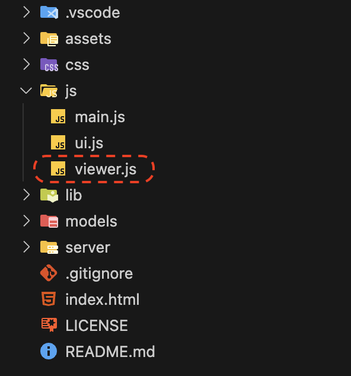
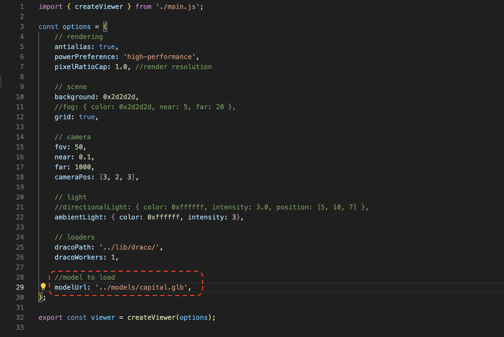
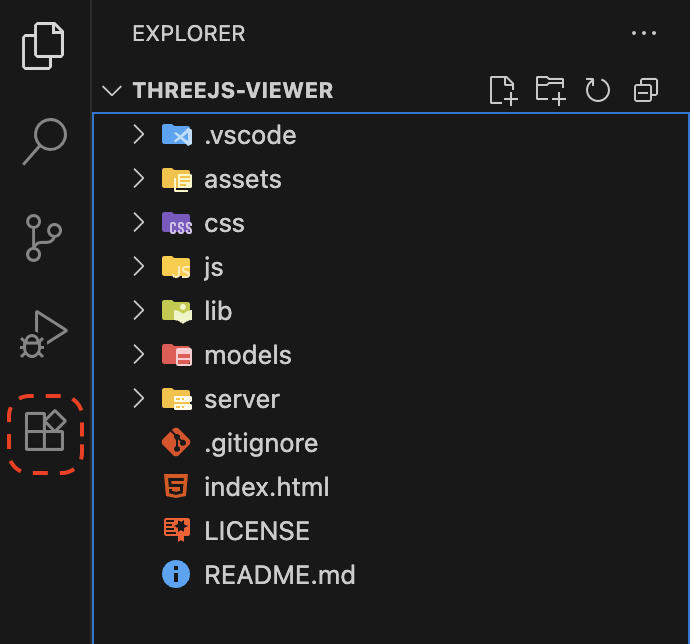

# Three.js Viewer
This project is a 3D viewer built using [Three.js](https://threejs.org/). Options such as lighting, fog, camera, and the model path can be adjusted through the viewer.js file.

## Usage
1. Create a new folder called `models` at the root of your project. Add the .glb model to that folder.

2. Expand the `JS` folder and open the viewer.js file.

3. Update the modelUrl to the name and path of your model. Usually something like: `../models/capital.glb`

4. Click the extensions tab on the left toolbar.

5. Search for and then install the [Live Server](https://marketplace.visualstudio.com/items?itemName=ritwickdey.LiveServer) plug-in.

6. Right-click on the `index.html` file and select **Open with Live Server**.

Your browser will automatically open the application.

## License
This project is licensed under the [MIT License](LICENSE).

